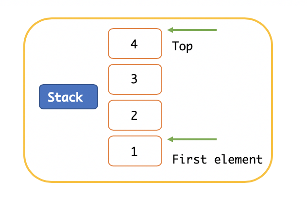
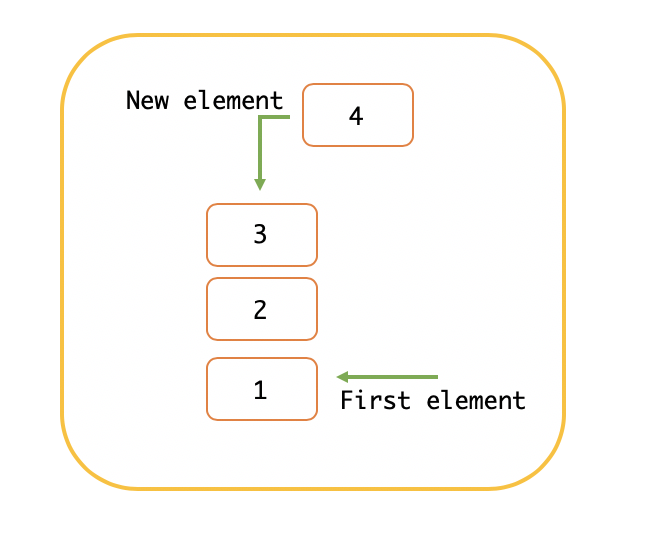
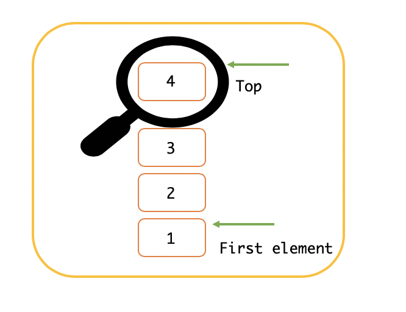
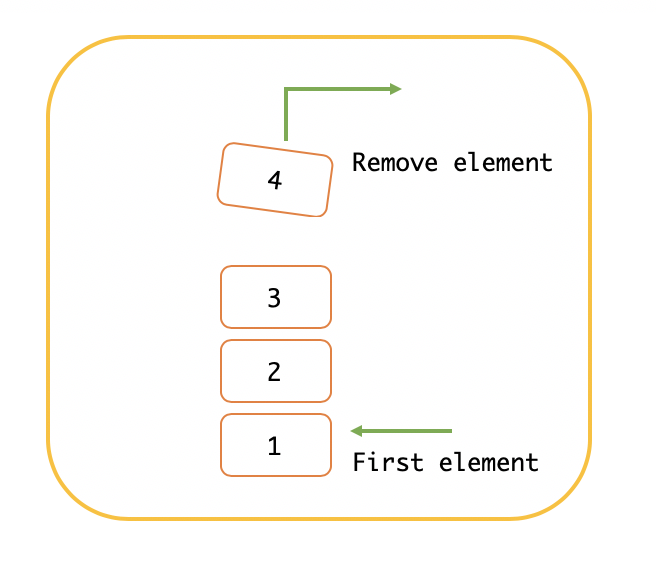

A stack is a linear data structure that allows data to be stored. Access to its elements is:  **LIFO** (Last In, First Out).

It is characterized by the operations of **push, pop, peek**, performing these operations with the end of the stack (top).



##  Operations of a stack
#### Push
It is when we add a new element to our stack. This is added on top of the stack.



#### Peek
It shows us the element of our stack that is at the top, that is, the last element added.



#### Pop
Operation that allows us to remove or eliminate the last element added to the stack



## Creating a stack application
We will build a simple application that allows us to perform the operations of a stack

### Class Node
First we will create the node class; with the constructor to receive as parameter the data that we want to add to our of the stack, and the following pointer.

``` python
class Node:
	def __init__ (self, data):
		self.data = data
		self.next = None
```
### Class stack
We create the stack class, initially with its constructor in which we define the head variables (which is the first element of the stack), initializing it with null.

``` python
class Stack:
	def __init__(self):
		self.head = None
```
#### Push operation
Followed by the constructor of the stack class, a method is created to add the elements to our stack. This method receives the current node as a parameter, that is, the element we are adding.
``` python
def push(self, Current_Node):
		if self.head is None:
			self.head = Current_Node
		else:
			temp = self.head
			while temp.next is not None:
				temp = temp.next
			temp.next = Current_Node
```

#### Peek operation
Method that prints the last element of the stack
``` python
def peek(self):
		if self.head is None:
			print("Empty list")
		else:
			temp = self.head
			while temp.next is not None:
				temp = temp.next
			print(temp.data, end=' ')
			print("\n")

```
#### Pop operation
Method to remove the last element from the stack.

``` python
def pop(self):
		if self.head is None:
			return
		elif self.head.next is None:
			self.head = None
		else:
			temp = self.head
			prev = self.head
			while temp.next is not None:
				prev = temp
				temp = temp.next
			prev.next = None
```

#### Print list

To print the items in the list of our stack, we go through each item that has been added.

``` python
def print_list(self):
		if self.head is None:
			print("Empty list")
		else:
			temp = self.head
			while temp.next is not None:
				print(temp.data, end=' ')
				print('->', end=' ')
				temp = temp.next
			print(temp.data, end=' ')
			print("\n")
```

#### Instance stack
Finally, we create a new instance of Stack. In this instance we add some values, we print these themselves; Then we make a peek that shows us the last added value and finally we pop and print the list again.
``` python
newStack = Stack()
newStack.push(Node("a"))
newStack.push(Node("b"))
newStack.push(Node("c"))
newStack.push(Node("d"))
newStack.print_list()
newStack.peek()
newStack.pop()
newStack.print_list()

```
#### Output
Our output is like this:
``` python
a -> b -> c -> d 

d 

a -> b -> c 

```

Check this project on [GitHub](https://github.com/KatherineSanchez98/stack).